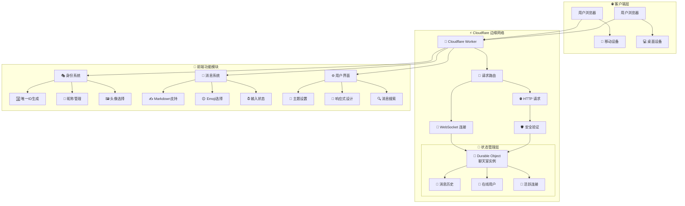
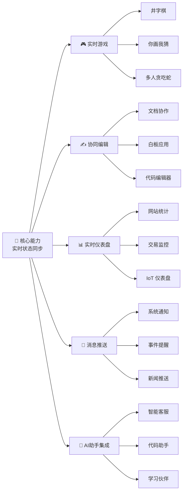
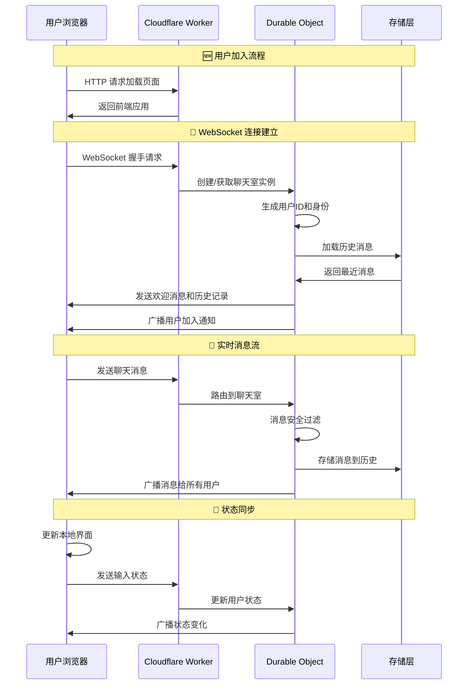
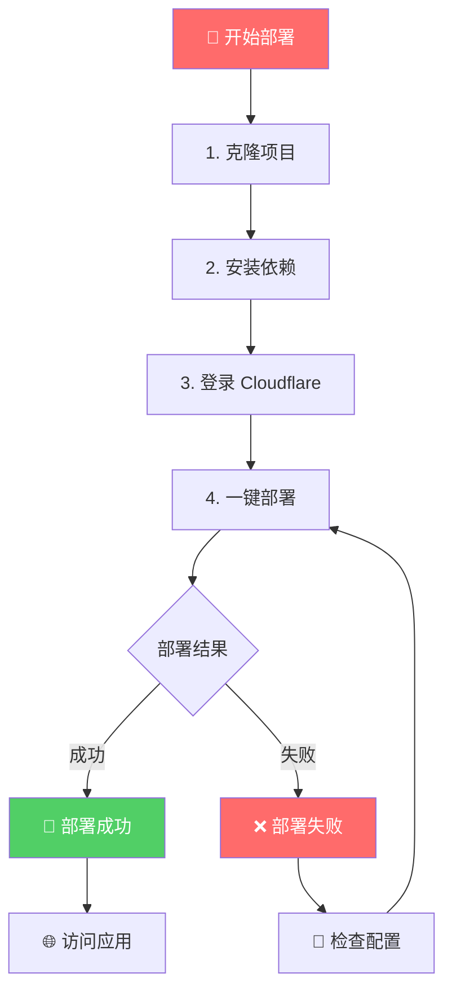
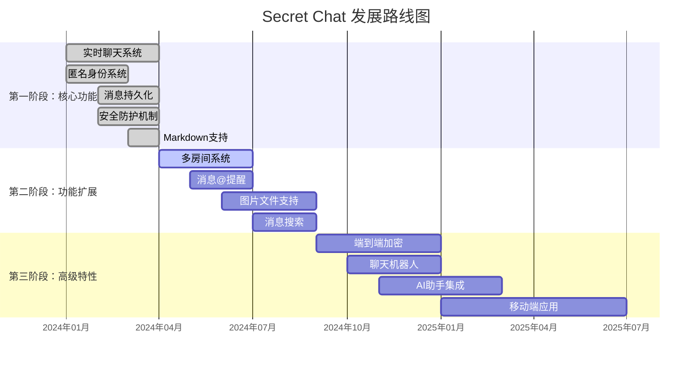

# 🤫 Secret Chat - 基于 Cloudflare 的匿名实时聊天室


> "在代码的世界里，我们不仅是建造者，更是思想的播种者。每一个字符，都可能孕育出一个连接你我的新宇宙。"

这是一个精巧而强大的项目，展示了如何利用 **Cloudflare 前沿技术**，在**几乎零成本**的情况下，构建功能完善、全球低延迟的匿名实时聊天应用。它不仅仅是一个聊天室，更是探索 `Serverless`（无服务器）和 `Edge Computing`（边缘计算）强大潜力的起点。

我们相信技术的力量在于连接与赋能。这个项目旨在降低技术门槛，让你亲手触摸"云"的脉搏，感受从一行代码到一个全球化应用的奇妙旅程。

**👉 [立即体验 Demo](https://cfwork-secret-chat-app.tfai.workers.dev/)** *(请将链接替换为你部署后的域名)*

---

## ✨ 核心特性

<div align="center">

### 🏗️ 系统架构总览



</div>

*   **🌍 全球实时同步** - 基于 Cloudflare 全球边缘网络，提供毫秒级消息同步体验
*   **🎭 动态匿名身份** - 自动生成独特"赛博格格不入"代号，支持自定义身份
*   **💾 状态持久化** - 使用 Durable Objects 安全保存聊天记录和在线状态
*   **🚀 Serverless 架构** - 按需运行，零服务器运维，极致成本效益
*   **🛡️ 安全可靠** - 内置 XSS 防护机制，保障聊天环境安全
*   **✍️ Markdown 支持** - 丰富的消息格式，支持代码块、引用等高级排版
*   **🤩 现代化交互** - 可伸缩面板、Emoji 选择器、实时输入提示

---

## 🎯 应用场景

这个项目的核心是"**状态同步**"和"**实时通信**"，应用场景远不止聊天室：

<div align="center">

### 💡 技术扩展蓝图



</div>

---

## 🛠️ 技术架构详解

"理解原理，是赋予代码灵魂的第一步。"

<div align="center">

### 🔧 技术栈与数据流



</div>

### 核心技术组件

| 模块 | 技术 | 难度 | 职责说明 | 学习路径 |
|------|------|------|----------|----------|
| **🌐 边缘计算** | Cloudflare Workers | ⭐☆☆☆☆ | 全球分布的"微型大脑"，按需运行代码 | `Cloudflare serverless` |
| **💾 状态管理** | Durable Objects | ⭐⭐⭐☆☆ | 有状态的 Worker，负责聊天室状态管理 | `Cloudflare Durable Objects tutorial` |
| **🔗 实时通信** | WebSocket | ⭐⭐☆☆☆ | 持久连接通道，实现双向实时通信 | `JavaScript WebSocket tutorial` |
| **🚀 部署工具** | Wrangler CLI | ⭐⭐☆☆☆ | 项目部署和管理的瑞士军刀 | `wrangler cli documentation` |
| **🎨 前端界面** | 原生 JS/HTML/CSS | ⭐☆☆☆☆ | 轻量级现代化用户界面 | (Web 开发基础) |
| **🛡️ 安全防护** | DOMPurify | ⭐⭐☆☆☆ | HTML 消毒，防止 XSS 攻击 | `DOMPurify security` |
| **📝 格式渲染** | Marked.js | ⭐☆☆☆☆ | Markdown 到 HTML 的实时转换 | `marked.js documentation` |
| **💾 本地存储** | localStorage | ⭐☆☆☆☆ | 客户端数据持久化存储 | `Web Storage API` |
| **🆔 身份系统** | Crypto API | ⭐⭐☆☆☆ | 密码学安全的唯一标识生成 | `Web Crypto API` |

---

## 🚀 快速部署指南

"Talk is cheap, show me the code... and the button!"

我们已将部署过程简化到极致，只需几个命令即可拥有自己的全球聊天应用。

### 📋 环境准备

1.  **[注册 Cloudflare 账户](https://dash.cloudflare.com/sign-up)** - 完全免费
2.  **[安装 Node.js](https://nodejs.org/)** - 选择 LTS 版本
3.  **[安装 Git](https://git-scm.com/downloads)** - 代码版本管理

### 🎯 部署三步曲

<div align="center">

### 📦 部署流程



</div>

**第一步：获取代码 💻**
```bash
# 克隆项目到本地
git clone https://github.com/lzA6/CFwork-secret-chat-app.git
cd CFwork-secret-chat-app
```

**第二步：环境配置 🔑**
```bash
# 安装项目依赖
npm install

# 登录 Cloudflare 账户（会自动打开浏览器）
npx wrangler login
```

**第三步：一键部署 🚀**
```bash
# 部署到 Cloudflare 全球网络
npx wrangler deploy
```

部署成功后，终端会显示你的专属访问链接：
```
✅ Deployment complete!
Your project is available at: https://cfwork-secret-chat-app.your-username.workers.dev
```

**恭喜！你的全球匿名聊天室已经上线运行！🎉**

---

## ⚖️ 架构分析与思考

"没有完美的代码，只有不断进化的思想。"

### ✅ 架构优势

<div align="center">

### 🏆 技术优势对比

| 特性 | 传统架构 | **Secret Chat** | 优势分析 |
|------|----------|-----------------|----------|
| **💰 成本** | 服务器固定费用 | **按使用量计费** | 节省 90%+ 成本 |
| **🌍 延迟** | 单区域部署 | **全球边缘部署** | 延迟降低 50-80% |
| **🔄 运维** | 复杂服务器管理 | **完全免运维** | 零运维工作量 |
| **📈 扩容** | 手动扩容 | **自动无限扩容** | 秒级应对流量峰值 |
| **🛡️ 安全** | 自行维护 | **平台级安全** | 企业级安全防护 |

</div>

### ⚠️ 架构限制

1.  **Durable Object 地域限制** - 单个实例存在地域限制，全球用户连接可能产生延迟差异
2.  **冷启动延迟** - 休眠状态唤醒时需要数百毫秒到数秒的初始化时间
3.  **状态查询限制** - 不适合复杂的关系查询和大规模数据分析场景

### 💡 架构哲学

技术选型总是一场权衡。我们选择 `Serverless` 和 `Durable Objects`，是用"状态管理"的限制换取"全球化"、"低成本"和"免运维"的巨大优势。

这就像极简主义：放弃笨重家具，获得随时出发的自由。我们的代码轻盈灵活，能在全球每个角落快速安家。

**我们是否真的需要复杂系统？还是可以用更聪明的方式解决核心问题？** 这不仅是技术选择，更是追求高效、简约的价值观体现。

---

## 🗺️ 发展路线图

"一个项目的伟大，不在于它现在是什么，而在于它将要成为什么。"

<div align="center">

### 🚀 功能演进规划



</div>

### 🎯 近期规划

| 优先级 | 功能 | 技术方案 | 预计周期 |
|--------|------|----------|----------|
| 🔥 高 | **多房间系统** | 基于房间名的 Durable Object 分片 | 2-3 周 |
| 🔥 高 | **图片文件支持** | Cloudflare R2 + 预签名 URL | 3-4 周 |
| 🔥 高 | **消息@提醒** | 用户提及检测与高亮显示 | 1-2 周 |
| 🔶 中 | **消息搜索** | 客户端索引 + 服务端过滤 | 2-3 周 |
| 🔶 中 | **主题系统** | CSS 变量 + 本地存储 | 1 周 |

### 🛠️ 技术演进路径

1.  **多房间系统实现**
    ```javascript
    // 技术方案：基于路径的路由
    const roomName = new URL(request.url).pathname.split('/').pop() || 'main';
    const roomId = env.CHAT_ROOM.idFromName(roomName);
    const room = env.CHAT_ROOM.get(roomId);
    ```

2.  **文件上传架构**
    ```mermaid
    graph LR
        A[前端选择文件] --> B[获取预签名URL]
        B --> C[直传R2存储]
        C --> D[返回文件URL]
        D --> E[发送消息]
        E --> F[广播渲染]
    ```

3.  **全球延迟优化** - 区域性 Durable Objects + 状态同步机制

---

## 📂 项目结构

```
secret-chat/
├── 📄 package.json           # 项目配置和依赖管理
├── ⚙️ wrangler.toml          # Cloudflare Workers 配置
├── 🔒 .gitignore            # Git 忽略规则
└── 📁 src/
    └── 🚀 index.js          # 核心应用逻辑（前后端一体）
```

---

## 🤝 贡献与致谢

感谢你阅读到这里！你对这个项目的好奇心，正是开源世界生生不息的火焰。

我们坚信最好的学习方式就是动手实践。不要害怕犯错，每一次 `ERROR` 都是一次成长的机会。我们都曾经历过从"完全不懂"到"好像有点明白了"再到"原来如此！"的顿悟时刻。

### 🎁 如何参与贡献

1. **报告问题** - 遇到 Bug？欢迎提交 Issue
2. **功能建议** - 有好的想法？告诉我们！
3. **代码贡献** - 直接提交 Pull Request
4. **文档改进** - 帮助完善使用文档
5. **分享案例** - 告诉我们你的使用场景

### 📜 开源协议

本项目基于 [Apache 2.0](https://opensource.org/licenses/Apache-2.0) 协议开源，你可以自由使用、修改和分发。

---

<div align="center">

### 🎉 开始你的 Serverless 之旅

**大胆尝试，勇敢探索，用代码创造无限可能！**

[🚀 立即部署](#-快速部署指南) | [🐛 报告问题](https://github.com/lzA6/CFwork-secret-chat-app/issues) | [💡 功能建议](https://github.com/lzA6/CFwork-secret-chat-app/discussions)

*Happy Hacking! 🚀*

</div>
