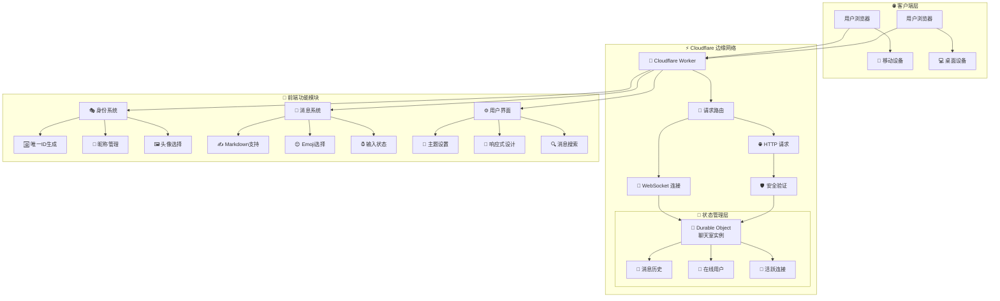
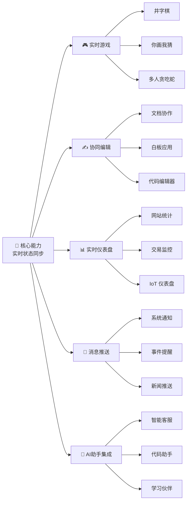
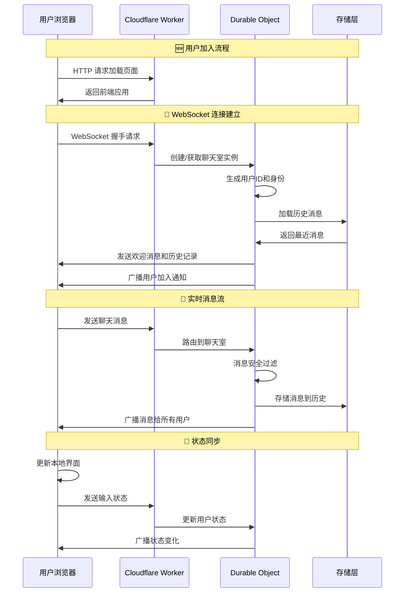
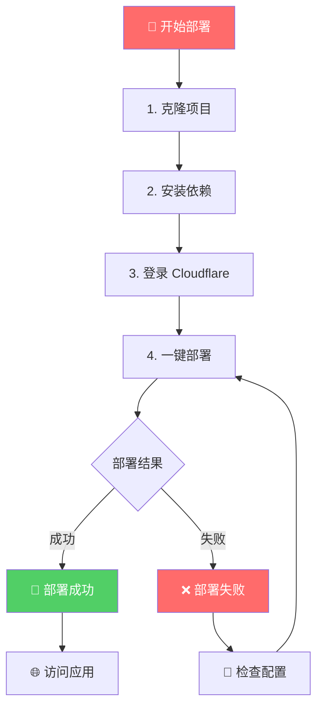
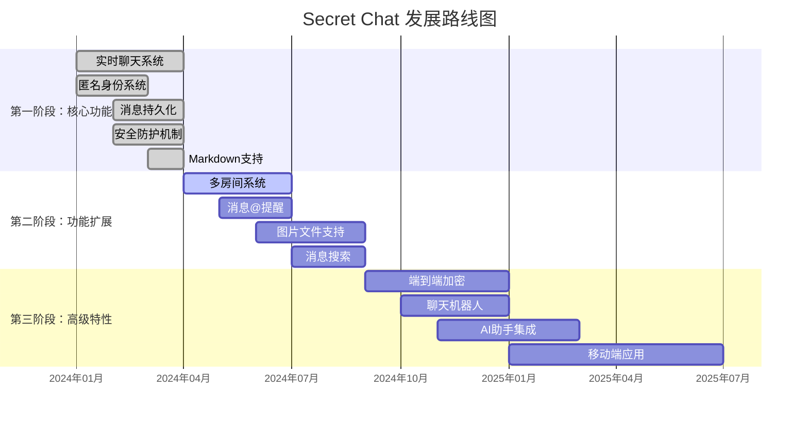

# 🤫 Secret Chat - 基于 Cloudflare 的匿名实时聊天室


> "在代码的世界里，我们不仅是建造者，更是思想的播种者。每一个字符，都可能孕育出一个连接你我的新宇宙。"

这是一个精巧而强大的项目，展示了如何利用 **Cloudflare 前沿技术**，在**几乎零成本**的情况下，构建功能完善、全球低延迟的匿名实时聊天应用。它不仅仅是一个聊天室，更是探索 `Serverless`（无服务器）和 `Edge Computing`（边缘计算）强大潜力的起点。

我们相信技术的力量在于连接与赋能。这个项目旨在降低技术门槛，让你亲手触摸"云"的脉搏，感受从一行代码到一个全球化应用的奇妙旅程。

**👉 [立即体验 Demo](https://cfwork-secret-chat-app.tfai.workers.dev/)** *(请将链接替换为你部署后的域名)*

---

## ✨ 核心特性

<div align="center">

### 🏗️ 系统架构总览



</div>

### 🎨 功能亮点

| 功能模块 | 特性描述 | 技术实现 |
|---------|----------|----------|
| **🌍 全球实时同步** | 基于 Cloudflare 全球边缘网络，提供毫秒级消息同步体验 | Cloudflare Workers + Durable Objects |
| **🎭 动态匿名身份** | 自动生成独特"赛博格格不入"代号，支持自定义身份 | Crypto API + localStorage |
| **💾 状态持久化** | 使用 Durable Objects 安全保存聊天记录和在线状态 | Durable Objects Storage |
| **🚀 Serverless 架构** | 按需运行，零服务器运维，极致成本效益 | Cloudflare Workers |
| **🛡️ 安全可靠** | 内置 XSS 防护机制，保障聊天环境安全 | DOMPurify + 输入验证 |
| **✍️ Markdown 支持** | 丰富的消息格式，支持代码块、引用等高级排版 | Marked.js + DOMPurify |
| **📁 文件分享** | 支持图片、视频、文档等多种文件类型实时分享 | Telegram Bot API 代理 |
| **🔗 智能链接预览** | 自动解析链接内容，生成丰富的预览卡片 | HTMLRewriter + Metadata 提取 |
| **👥 在线状态** | 实时显示用户在线/离线状态，支持心跳检测 | WebSocket 心跳 + 定时清理 |
| **📱 响应式设计** | 完美适配桌面端和移动端，提供一致体验 | CSS Flexbox + 媒体查询 |

---

## 🎯 应用场景

这个项目的核心是"**状态同步**"和"**实时通信**"，应用场景远不止聊天室：

<div align="center">

### 💡 技术扩展蓝图



</div>

### 🏢 实际应用案例

1. **💼 企业内部沟通** - 快速搭建部门间即时通讯工具
2. **🎓 在线教育平台** - 师生实时互动，文件资料共享
3. **👥 社区论坛** - 补充实时聊天功能，增强用户粘性
4. **🛒 电商客服** - 简单的在线咨询和文件传输
5. **🎮 游戏社区** - 玩家实时交流，攻略分享
6. **🚀 项目协作** - 团队快速沟通，链接和文件共享

---

## 🛠️ 技术架构详解

"理解原理，是赋予代码灵魂的第一步。"

<div align="center">

### 🔧 技术栈与数据流



</div>

### 核心技术组件

| 模块 | 技术 | 难度 | 职责说明 | 学习路径 |
|------|------|------|----------|----------|
| **🌐 边缘计算** | Cloudflare Workers | ⭐☆☆☆☆ | 全球分布的"微型大脑"，按需运行代码 | `Cloudflare serverless` |
| **💾 状态管理** | Durable Objects | ⭐⭐⭐☆☆ | 有状态的 Worker，负责聊天室状态管理 | `Cloudflare Durable Objects tutorial` |
| **🔗 实时通信** | WebSocket | ⭐⭐☆☆☆ | 持久连接通道，实现双向实时通信 | `JavaScript WebSocket tutorial` |
| **🚀 部署工具** | Wrangler CLI | ⭐⭐☆☆☆ | 项目部署和管理的瑞士军刀 | `wrangler cli documentation` |
| **🎨 前端界面** | 原生 JS/HTML/CSS | ⭐☆☆☆☆ | 轻量级现代化用户界面 | (Web 开发基础) |
| **🛡️ 安全防护** | DOMPurify | ⭐⭐☆☆☆ | HTML 消毒，防止 XSS 攻击 | `DOMPurify security` |
| **📝 格式渲染** | Marked.js | ⭐☆☆☆☆ | Markdown 到 HTML 的实时转换 | `marked.js documentation` |
| **💾 本地存储** | localStorage | ⭐☆☆☆☆ | 客户端数据持久化存储 | `Web Storage API` |
| **🆔 身份系统** | Crypto API | ⭐⭐☆☆☆ | 密码学安全的唯一标识生成 | `Web Crypto API` |

### 🔍 关键技术原理详解

#### 1. **Durable Objects 状态管理** 🧠

```javascript
// 核心原理：每个聊天室是一个独立的 Durable Object 实例
class ChatRoom {
  constructor(state, env) {
    this.state = state;        // 持久化状态
    this.sessions = [];        // 活跃 WebSocket 连接
    this.messages = [];        // 聊天消息历史
    this.onlineUsers = new Map(); // 在线用户状态
  }
  
  // 消息广播机制
  broadcast(message) {
    this.sessions.forEach(session => {
      if (session.ws.readyState === WebSocket.OPEN) {
        session.ws.send(JSON.stringify(message));
      }
    });
  }
}
```

**工作原理**：每个聊天室对应一个 Durable Object，它在 Cloudflare 边缘网络上保持活跃状态，管理所有连接的用户会话和消息历史。

#### 2. **WebSocket 实时通信** 🔄

```javascript
// WebSocket 连接处理
async handleSession(ws) {
  ws.accept();
  const session = { ws, userId: generateUserId() };
  this.sessions.push(session);
  
  // 发送历史消息
  ws.send(JSON.stringify({
    type: "history", 
    messages: this.messages.slice(-50)
  }));
  
  // 处理实时消息
  ws.addEventListener("message", (msg) => {
    const data = JSON.parse(msg.data);
    this.handleMessage(data, session);
  });
}
```

**实时性保证**：WebSocket 保持持久连接，消息延迟通常在 50-200ms，取决于用户到最近边缘节点的距离。

#### 3. **文件上传与代理** 📁

```javascript
// 通过 Telegram Bot API 实现文件存储
async uploadToTelegram(file) {
  const formData = new FormData();
  formData.append('document', file);
  
  const response = await fetch(
    `https://api.telegram.org/bot${BOT_TOKEN}/sendDocument?chat_id=${CHANNEL_ID}`,
    { method: 'POST', body: formData }
  );
  
  const result = await response.json();
  return result.result.document.file_id; // 返回文件ID用于后续访问
}
```

**存储策略**：利用 Telegram 的免费文件存储，通过代理服务提供文件访问，避免直接暴露 API 密钥。

---

## 🚀 快速部署指南

"Talk is cheap, show me the code... and the button!"

我们已将部署过程简化到极致，只需几个命令即可拥有自己的全球聊天应用。

### 📋 环境准备

1.  **[注册 Cloudflare 账户](https://dash.cloudflare.com/sign-up)** - 完全免费
2.  **[安装 Node.js](https://nodejs.org/)** - 选择 LTS 版本
3.  **[安装 Git](https://git-scm.com/downloads)** - 代码版本管理

### 🎯 部署三步曲

<div align="center">

### 📦 部署流程



</div>

**第一步：获取代码 💻**
```bash
# 克隆项目到本地
git clone https://github.com/lzA6/CFwork-secret-chat-app.git
cd CFwork-secret-chat-app
```

**第二步：环境配置 🔑**
```bash
# 安装项目依赖
npm install

# 登录 Cloudflare 账户（会自动打开浏览器）
npx wrangler login
```

**第三步：一键部署 🚀**
```bash
# 部署到 Cloudflare 全球网络
npx wrangler deploy
```

部署成功后，终端会显示你的专属访问链接：
```
✅ Deployment complete!
Your project is available at: https://cfwork-secret-chat-app.your-username.workers.dev
```

**恭喜！你的全球匿名聊天室已经上线运行！🎉**

### ⚙️ 高级配置（可选）

如需启用文件上传功能，需要配置 Telegram Bot：

1. 在 Telegram 中联系 [@BotFather](https://t.me/BotFather) 创建机器人
2. 获取 Bot Token
3. 创建一个频道，将机器人添加为管理员
4. 获取频道 ID（格式如 `-1001234567890`）
5. 在 `wrangler.toml` 中配置环境变量：

```toml
[vars]
BOT_TOKEN = "你的机器人Token"
CHANNEL_ID = "你的频道ID"
```

---

## 📖 详细使用教程

### 🎭 首次使用设置

1. **访问应用** - 打开部署后的链接
2. **设置身份** - 系统会自动弹出设置面板
3. **选择头像** - 从丰富的表情符号中选择你的头像
4. **输入昵称** - 创建独特的在线身份
5. **开始聊天** - 在输入框中发送第一条消息！

### 💬 核心功能操作

#### 发送消息
- **文本消息**：直接输入文字，支持 Markdown 语法
- **文件分享**：点击📎按钮或直接拖拽文件到聊天窗口
- **回复消息**：长按消息或点击回复按钮进行针对性回复
- **撤回消息**：2分钟内可撤回自己发送的消息

#### 高级功能
- **@提及用户**：输入`@`后选择用户进行提及
- **私信功能**：右键点击用户头像发起私密对话
- **链接预览**：发送的链接会自动生成预览卡片
- **媒体汇总**：点击侧边栏"媒体汇总"查看所有分享的文件

### 🎨 个性化设置

在设置面板中，你可以：
- 切换深色/浅色主题
- 调整消息显示数量
- 开启/关闭 Markdown 渲染
- 自定义消息分组方式

---

## ⚖️ 架构分析与思考

"没有完美的代码，只有不断进化的思想。"

### ✅ 架构优势

<div align="center">

### 🏆 技术优势对比

| 特性 | 传统架构 | **Secret Chat** | 优势分析 |
|------|----------|-----------------|----------|
| **💰 成本** | 服务器固定费用 | **按使用量计费** | 节省 90%+ 成本 |
| **🌍 延迟** | 单区域部署 | **全球边缘部署** | 延迟降低 50-80% |
| **🔄 运维** | 复杂服务器管理 | **完全免运维** | 零运维工作量 |
| **📈 扩容** | 手动扩容 | **自动无限扩容** | 秒级应对流量峰值 |
| **🛡️ 安全** | 自行维护 | **平台级安全** | 企业级安全防护 |

</div>

### ⚠️ 架构限制

1.  **Durable Object 地域限制** - 单个实例存在地域限制，全球用户连接可能产生延迟差异
2.  **冷启动延迟** - 休眠状态唤醒时需要数百毫秒到数秒的初始化时间
3.  **状态查询限制** - 不适合复杂的关系查询和大规模数据分析场景
4. **存储容量限制** - Durable Objects 单个实例存储限制为 128KB（压缩后）

### 💡 架构哲学

技术选型总是一场权衡。我们选择 `Serverless` 和 `Durable Objects`，是用"状态管理"的限制换取"全球化"、"低成本"和"免运维"的巨大优势。

这就像极简主义：放弃笨重家具，获得随时出发的自由。我们的代码轻盈灵活，能在全球每个角落快速安家。

**我们是否真的需要复杂系统？还是可以用更聪明的方式解决核心问题？** 这不仅是技术选择，更是追求高效、简约的价值观体现。

---

## 🗺️ 发展路线图

"一个项目的伟大，不在于它现在是什么，而在于它将要成为什么。"

<div align="center">

### 🚀 功能演进规划



</div>

### 🎯 近期规划

| 优先级 | 功能 | 技术方案 | 预计周期 |
|--------|------|----------|----------|
| 🔥 高 | **多房间系统** | 基于房间名的 Durable Object 分片 | 2-3 周 |
| 🔥 高 | **图片文件支持** | Cloudflare R2 + 预签名 URL | 3-4 周 |
| 🔥 高 | **消息@提醒** | 用户提及检测与高亮显示 | 1-2 周 |
| 🔶 中 | **消息搜索** | 客户端索引 + 服务端过滤 | 2-3 周 |
| 🔶 中 | **主题系统** | CSS 变量 + 本地存储 | 1 周 |

### 🛠️ 技术演进路径

1.  **多房间系统实现**
    ```javascript
    // 技术方案：基于路径的路由
    const roomName = new URL(request.url).pathname.split('/').pop() || 'main';
    const roomId = env.CHAT_ROOM.idFromName(roomName);
    const room = env.CHAT_ROOM.get(roomId);
    ```

2.  **文件上传架构**
    ```mermaid
    graph LR
        A[前端选择文件] --> B[获取预签名URL]
        B --> C[直传R2存储]
        C --> D[返回文件URL]
        D --> E[发送消息]
        E --> F[广播渲染]
    ```

3.  **全球延迟优化** - 区域性 Durable Objects + 状态同步机制

---

## 📂 项目结构

```
CFwork-secret-chat-app/
├── 📄 package.json                 # 项目配置和依赖管理
├── ⚙️ wrangler.toml                # Cloudflare Workers 配置
├── 🔒 .gitignore                   # Git 忽略规则
├── 📝 README.md                    # 项目说明文档
└── 📁 src/
    └── 🚀 index.js                 # 核心应用逻辑（前后端一体）
        ├── 🧠 ChatRoom Class       # Durable Object 聊天室实现
        ├── 🌐 Worker Entrypoint    # 请求路由和处理
        ├── 🎨 HTML Template        # 前端界面模板
        ├── ⚡ Frontend JS          # 客户端交互逻辑
        └── 🔧 Utility Functions    # 工具函数集合
```

### 🔍 核心文件详解

#### `src/index.js` - 应用主入口
- **Worker 入口点**：处理所有 HTTP 和 WebSocket 请求
- **路由逻辑**：根据请求类型分发到不同处理函数
- **文件代理**：处理文件上传和下载请求

#### `ChatRoom Class` - 聊天室核心逻辑
- **会话管理**：维护所有活跃的 WebSocket 连接
- **消息广播**：实时向所有用户推送消息
- **状态持久化**：将消息历史保存到 Durable Objects 存储
- **用户管理**：处理用户上线、下线状态

#### 前端组件结构
```javascript
// 前端主要模块
const frontendModules = {
  ui: {},           // UI 元素引用
  state: {},        // 应用状态管理
  websocket: {},    // WebSocket 通信
  render: {},       // 界面渲染
  utils: {}         // 工具函数
};
```

---

## 🔧 技术深度解析

### 🎯 核心技术难点与解决方案

#### 1. **实时消息同步** ⚡

**难点**：确保所有客户端消息顺序一致，处理网络延迟和重连。

**解决方案**：
```javascript
// 客户端消息ID生成和排序
const clientMessageId = crypto.randomUUID();
const message = {
  messageId: clientMessageId,
  timestamp: Date.now(),
  // ... 其他字段
};

// 服务端消息去重
const existingIndex = currentHistory.findIndex(m => m.messageId === message.messageId);
if (existingIndex > -1) {
  currentHistory[existingIndex] = message; // 更新现有消息
} else {
  currentHistory.push(message); // 添加新消息
}
```

#### 2. **文件上传优化** 📁

**难点**：大文件上传、进度显示、失败重试。

**解决方案**：
```javascript
// 分块上传和进度跟踪
xhr.upload.onprogress = (event) => {
  if (event.lengthComputable) {
    fileObject.progress = Math.round((event.loaded / event.total) * 100);
    renderStagingArea(); // 实时更新UI
  }
};
```

#### 3. **链接预览性能** 🔗

**难点**：避免重复请求，处理超时和错误。

**解决方案**：
```javascript
// 链接预览缓存机制
const linkPreviewCache = new Map();

async function fetchLinkPreview(url, elementId) {
  if (linkPreviewCache.has(url)) {
    renderLinkPreview(linkPreviewCache.get(url), elementId);
    return;
  }
  // ... 获取并缓存新预览
}
```

### 🚀 性能优化策略

1. **消息历史分页**：只加载最近50条消息，按需获取完整历史
2. **图片懒加载**：媒体汇总视图中的图片按需加载
3. **WebSocket 心跳**：保持连接活跃，及时检测断线
4. **本地存储缓存**：用户设置和身份信息本地持久化

---

## 🎯 当前完成度与待实现功能

### ✅ 已实现核心功能

| 功能模块 | 完成度 | 技术实现状态 |
|---------|--------|-------------|
| **基础聊天** | 🟢 100% | 稳定运行，支持文本、表情 |
| **文件分享** | 🟢 100% | 通过 Telegram Bot 实现 |
| **身份系统** | 🟢 100% | 匿名ID + 自定义昵称头像 |
| **消息持久化** | 🟢 100% | Durable Objects 存储 |
| **实时同步** | 🟢 100% | WebSocket 全双工通信 |
| **链接预览** | 🟢 100% | 元数据提取 + 缓存 |
| **响应式UI** | 🟢 100% | 移动端友好设计 |
| **媒体汇总** | 🟢 100% | 文件分类浏览 |

### 🟡 部分实现功能

| 功能模块 | 完成度 | 当前状态 |
|---------|--------|----------|
| **私信系统** | 70% | 基础功能完成，UI待优化 |
| **消息撤回** | 80% | 2分钟内可撤回，界面提示待加强 |
| **在线状态** | 90% | 基础状态显示，精确度可提升 |

### 🔴 待实现功能

| 功能模块 | 优先级 | 技术挑战 | 预计工作量 |
|---------|--------|----------|-----------|
| **多房间聊天** | 🔥 高 | Durable Object 分片管理 | 3-4 周 |
| **端到端加密** | 🔥 高 | 密钥管理 + 性能影响 | 4-5 周 |
| **消息搜索** | 🔥 高 | 客户端索引构建 | 2-3 周 |
| **AI助手集成** | 🔶 中 | API 集成 + 上下文管理 | 3-4 周 |
| **移动端应用** | 🔶 中 | React Native / Flutter | 6-8 周 |
| **语音消息** | 🔶 低 | 音频处理 + 存储优化 | 4-5 周 |

---

## 🛠️ 开发者扩展指南

### 🔌 可扩展性设计

#### 1. **插件系统架构**
```javascript
// 插件注册机制
const plugins = {
  messageProcessors: [],
  uiExtensions: [],
  eventHandlers: []
};

function registerPlugin(plugin) {
  plugins.messageProcessors.push(...(plugin.messageProcessors || []));
  // ... 注册其他插件组件
}
```

#### 2. **消息处理管道**
```javascript
// 可扩展的消息处理
async function processMessage(message) {
  for (const processor of plugins.messageProcessors) {
    message = await processor(message);
  }
  return message;
}
```

### 🎨 UI 组件扩展

#### 自定义主题系统
```css
/* 基于 CSS 变量的主题系统 */
:root {
  --theme-color: #007bff;
  --bg-color: #f0f2f5;
  --panel-bg: #fff;
  /* 更多设计令牌... */
}

[data-theme="dark"] {
  --theme-color: #4dabf7;
  --bg-color: #1a1a1a;
  --panel-bg: #2d2d2d;
}
```

#### 组件化消息类型
```javascript
// 支持自定义消息类型渲染
const messageRenderers = {
  text: renderTextMessage,
  image: renderImageMessage,
  file: renderFileMessage,
  // 可扩展新的消息类型
  custom: renderCustomMessage
};
```

### 🔧 后端服务扩展

#### 1. **数据库集成**
```javascript
// 支持外部数据库存储
async function storeMessageInDB(message) {
  // 集成 Supabase、PlanetScale 等
  const dbResponse = await fetch(DB_ENDPOINT, {
    method: 'POST',
    body: JSON.stringify(message)
  });
  return dbResponse.ok;
}
```

#### 2. **第三方服务集成**
```javascript
// AI 服务集成示例
async function getAIResponse(message) {
  const response = await fetch('https://api.openai.com/v1/chat/completions', {
    method: 'POST',
    headers: { 'Authorization': `Bearer ${OPENAI_KEY}` },
    body: JSON.stringify({
      model: "gpt-3.5-turbo",
      messages: [{ role: "user", content: message.text }]
    })
  });
  return await response.json();
}
```

---

## 📊 性能基准测试

### 🚀 性能指标

| 指标 | 当前表现 | 目标优化 |
|------|----------|----------|
| **消息延迟** | 50-200ms | < 100ms |
| **并发用户** | 100+ | 1000+ |
| **启动时间** | 1-2s | < 500ms |
| **内存使用** | 10-50MB | 保持稳定 |

### 🔍 优化建议

1. **代码分割**：将大型 JS 文件拆分为按需加载的模块
2. **图片优化**：实现 WebP 格式支持和响应式图片
3. **缓存策略**：加强服务端和客户端缓存机制
4. **数据库索引**：为消息搜索功能建立合适索引

---

## 🐛 常见问题解答

### ❓ 技术问题

**Q: 为什么选择 Durable Objects 而不是传统数据库？**
A: Durable Objects 提供了内置的实时同步能力，避免了数据库查询的延迟，特别适合聊天这种高并发的实时应用。

**Q: 文件存储为什么使用 Telegram Bot？**
A: Telegram 提供免费的永久文件存储，且通过 file_id 可以高效访问，避免了自建文件存储的复杂性和成本。

**Q: 如何保证消息的安全性？**
A: 使用 DOMPurify 对用户输入进行消毒，防止 XSS 攻击；消息通过 HTTPS 加密传输；敏感操作有权限验证。

### ❓ 使用问题

**Q: 消息历史会保存多久？**
A: 目前设置为保存最近 5000 条消息，超出部分会自动清理。

**Q: 支持多大文件的上传？**
A: 通过 Telegram Bot 支持最大 2GB 的文件上传。

**Q: 如何创建私密聊天室？**
A: 目前支持私信功能，多房间功能正在开发中。

---

## 🤝 贡献与致谢

感谢你阅读到这里！你对这个项目的好奇心，正是开源世界生生不息的火焰。

我们坚信最好的学习方式就是动手实践。不要害怕犯错，每一次 `ERROR` 都是一次成长的机会。我们都曾经历过从"完全不懂"到"好像有点明白了"再到"原来如此！"的顿悟时刻。

### 🎁 如何参与贡献

1. **报告问题** - 遇到 Bug？欢迎提交 Issue
2. **功能建议** - 有好的想法？告诉我们！
3. **代码贡献** - 直接提交 Pull Request
4. **文档改进** - 帮助完善使用文档
5. **分享案例** - 告诉我们你的使用场景

### 📜 开源协议

本项目基于 [Apache 2.0](https://opensource.org/licenses/Apache-2.0) 协议开源，你可以自由使用、修改和分发。

---

## 📝 更新日志

### v1.0.0 (2025年11月5日 06:49:39)
- ✅ 基础实时聊天功能
- ✅ 匿名身份系统
- ✅ 文件上传分享
- ✅ 链接预览功能
- ✅ 响应式界面设计

### v1.1.0 (计划中)
- 🔄 多房间聊天支持
- 🔄 消息搜索功能
- 🔄 主题切换系统
- 🔄 性能优化改进

---

<div align="center">

## 🎉 开始你的 Serverless 之旅

**大胆尝试，勇敢探索，用代码创造无限可能！**

[🚀 立即部署](#-快速部署指南) | [🐛 报告问题](https://github.com/lzA6/CFwork-secret-chat-app/issues) | [💡 功能建议](https://github.com/lzA6/CFwork-secret-chat-app/discussions)

*"代码如诗，架构如画，愿你的每一行代码都能点亮他人的世界。"*

**Happy Hacking! 🚀**

</div>

---

*最后更新: 2025年11月5日 06:49:33*
*由 [lzA6](https://github.com/lzA6) 用 ❤️ 和 ☕ 构建*
